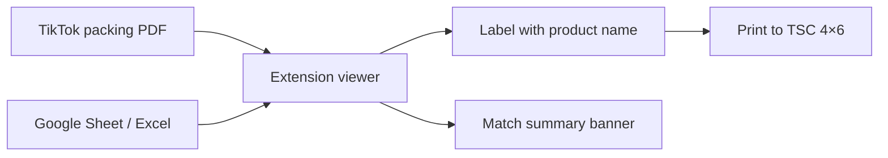

<div align="center">

# TikTok Packer

**Turn TikTok Shop packing-list PDFs into print-ready 4×6 thermal labels — with product names pulled straight from your spreadsheet.**

[](https://developer.chrome.com/docs/extensions/mv3/)
[](manifest.json)
[](https://seller.tiktok.com/)

*No server. No subscription. Your data stays in the browser.*

[Quick start](#-quick-start) · [How matching works](#-how-live-matching-works) · [Settings](#%EF%B8%8F-settings) · [Troubleshooting](#-troubleshooting)

</div>

---

## The problem

TikTok Shop packing lists show **Seller SKU** — your auction sale number (e.g. `810`) — but **not** the product name the buyer won.

When you're packing dozens of orders after a live stream, reading sale numbers off a PDF and cross-referencing a spreadsheet is slow and error-prone.

## The solution

**TikTok Packer** is a Chrome extension that:

1. Intercepts packing-list PDFs from TikTok Seller Center
2. Looks up each sale number in your Google Sheet or Excel workbook
3. Overlays the product name on a **4×6 thermal label** layout
4. Tells you exactly which sale numbers didn't match — before you print



---

## ✨ Features

| Feature | What it does |
|---------|--------------|
| **Auto PDF capture** | Opens packing lists in a custom viewer instead of Chrome's built-in PDF reader |
| **Google Sheet linking** | Paste one spreadsheet URL — every tab loads as a separate live |
| **Excel workbook upload** | Works offline with a local `.xlsx` file |
| **Live screen detection** | Configurable keyword (`SCREEN`, `FRAGRANCE`, etc.) maps PDF rows to the right spreadsheet tab |
| **Strict live matching** | Only matches within the detected live — no cross-tab guessing |
| **Smart sale # filtering** | Ignores long TikTok platform SKUs; only looks up real auction sale numbers |
| **Match summary** | `8 matched · 1 no match` banner with a list of missing sale numbers |
| **Red highlight** | Unmatched rows are visually flagged on the label |
| **Auto-refresh** | Product data reloads every time you open a PDF |
| **Item checks** | Optional column C gate — block packing until checks are cleared |
| **Backup & restore** | Export/import settings, spreadsheet URL, and workbook in one JSON file |
| **Thermal-ready** | Renders at 4×6 in @ 203 DPI (TSC and similar printers) |

---

## 🚀 Quick start

### 1. Install

```bash
git clone https://github.com/aidanhstewart/TikTokAuctionPacker-unlimited.git
```

1. Open **`chrome://extensions`**
2. Enable **Developer mode** (top right)
3. Click **Load unpacked** → select the cloned folder

### 2. Connect your product data

**Option A — Google Spreadsheet** *(recommended)*

1. Click the extension icon → **Google Sheet** tab
2. Paste your spreadsheet URL
3. Share the sheet as **Anyone with the link can view**
4. Click **Link spreadsheet**

> Every tab in the spreadsheet becomes a live: tab 1 → Live 1, tab 2 → Live 2, and so on. Data refreshes automatically each time you open a PDF.

**Option B — Excel workbook**

1. Click **Workbook** tab
2. Upload a `.xlsx` file (export from Google Sheets via *File → Download → Microsoft Excel*)

### 3. Pack and print

1. Open a packing list from **TikTok Seller Center** — the extension redirects it to the label viewer
2. Check the toolbar: **Sheet data: refreshed …**
3. Review the match summary banner at the top
4. Click **Print labels** (TSC: 4×6, scale 100%, no fit-to-page)

---

## 📋 Spreadsheet format

| Column A | Column B | Column C *(optional)* |
|----------|----------|------------------------|
| Sale # | Product name | Item check |
| 62 | 500ML DESIRE | |
| 810 | FAIRY 2.6L | ✓ |

**Rules:**

- **Row 1** is the header row (skipped by default)
- **Column A** = auction sale number — the short number from the PDF's **Seller SKU** column
- **Column B** = product name printed on the label
- **Column C** = item checks — if enabled, packing is blocked while any cell has a value
- Tabs whose name contains **`COST`** are ignored automatically

---

## 🎯 How live matching works

TikTok packing lists group orders by live stream. The extension reads the **product title** on each row and figures out which spreadsheet tab to search.

### Screen keyword

Set your keyword in **Settings → Screen keyword** (default: `SCREEN`).

| PDF row title | Keyword `SCREEN` | Keyword `FRAGRANCE` |
|---------------|------------------|---------------------|
| `MONDAY LIVE - AS SEEN ON SCREEN` | Live 1 | — |
| `MONDAY LIVE - AS SEEN ON SCREEN 2` | Live 2 | — |
| `MONDAY LIVE - BEDDING, HOMEWARE & FRAGRANCE` | — | Live 1 |
| `MONDAY LIVE - BEDDING, HOMEWARE & FRAGRANCE 2` | — | Live 2 |

Rows **below** a keyword header inherit that live until the next keyword appears.

### Strict live matching

Enable **Settings → Strict live matching** when you run multiple lives in one spreadsheet and want zero cross-tab guessing.

| | Normal | Strict |
|---|--------|--------|
| Assigns a live | Keyword, `LIVE -` titles, or inherited context | **Only** when your keyword appears (then inherited below) |
| Lookup fallback | Searches other tabs if not found | **Only** the assigned live tab |
| Default to Live 1 | Yes, when nothing else matches | **No** |

### Sale number filtering

PDFs contain two kinds of numbers in the SKU area:

- **Auction sale numbers** — short values like `62`, `810` → looked up in your sheet
- **TikTok platform SKUs** — long 15–18 digit IDs → **ignored** (not counted as misses)

---

## ⚙️ Settings

Open **Settings** from the extension popup.

<details>
<summary><strong>Live screen matching</strong></summary>

| Setting | Description |
|---------|-------------|
| Screen keyword | Word that identifies live blocks in PDF titles |
| Strict live matching | Keyword-only live assignment + no cross-tab lookup |

</details>

<details>
<summary><strong>Workbook columns</strong></summary>

| Setting | Default | Description |
|---------|---------|-------------|
| Sale # column | A | Auction sale number |
| Product column | B | Name printed on label |
| Item-check column | C | Must be empty before packing |
| Header rows | 1 | Rows to skip at top of each tab |
| Ignore tabs containing | COST | Tab name filter |

</details>

<details>
<summary><strong>Label overlay</strong></summary>

| Setting | Default | Description |
|---------|---------|-------------|
| Show live prefix | On | Prefix matched names with `S1:`, `S2:`, etc. |
| Prefix format | `S{n}:` | Use `{n}` for live number (space before product name is automatic) |
| No-match text | `no match` | Shown when lookup fails |

</details>

<details>
<summary><strong>Printer, PDF parsing, redirects, backup</strong></summary>

- **Printer** — Label size (4×6 in), DPI (203), render scale, mono threshold
- **PDF parsing** — Row Y tolerance and Seller SKU column alignment
- **Auto-open PDFs** — Intercept TikTok packing-list URLs automatically
- **Item checks** — Enable/disable and block packing when checks are pending
- **Backup & restore** — Export or import full config as JSON
- **Debug logging** — Console output per sale lookup (F12 in viewer)

</details>

---

## 🔧 Troubleshooting

<details>
<summary><strong>Spreadsheet won't link</strong></summary>

- Confirm the sheet is shared as **Anyone with the link can view**
- Use the main spreadsheet URL (`/spreadsheets/d/...`), not a single-tab link
- Click **Reload** in the popup to force a fresh fetch

</details>

<details>
<summary><strong>Everything shows "no match"</strong></summary>

- Check that sale numbers in column A match the **Seller SKU** column in the PDF (short numbers, not long platform IDs)
- Verify the correct live tab — try enabling **Strict live matching** to catch wrong keyword detection
- Open the viewer console (F12) with **Debug logging** enabled to see per-row lookups

</details>

<details>
<summary><strong>Wrong live tab is used</strong></summary>

- Confirm your **screen keyword** matches the text in the PDF row titles
- Enable **Strict live matching** so rows only match after your keyword appears
- Remember: spreadsheet tab order = Live 1, Live 2, …

</details>

<details>
<summary><strong>Match summary looks wrong</strong></summary>

- Long numeric IDs in the PDF are TikTok platform SKUs — the extension ignores these automatically
- Only short auction sale numbers (≤ 10 digits) are counted in the summary
- With strict matching on, only rows under a keyword-detected live are included

</details>

<details>
<summary><strong>Print quality issues</strong></summary>

- Printer: **4×6 label**, **scale 100%**, **no fit-to-page**
- Default DPI is 203 (TSC thermal). Adjust in Settings if your printer differs
- Increase **render scale** for sharper text on high-DPI printers

</details>

---

## 🐛 Debug output

Enable **Debug logging in viewer** in Settings, then open the browser console (F12) while viewing a PDF:

```
[TikTokPacker] {
  page: 1,
  saleNumber: "62",
  sheetIndex: 2,
  detectedTitle: "MONDAY LIVE - AS SEEN ON SCREEN 2",
  lookedUpProduct: "FAIRY 2.6L"
}
```

---

## 📁 Project structure

```
TikTokAuctionPacker-unlimited/
├── manifest.json          Chrome MV3 manifest
├── background.js          PDF redirect to custom viewer
├── popup.html / .js / .css   Extension popup UI
├── viewer.html / .js      Label viewer + print pipeline
├── pdfParser.js           TikTok packing-list table parser
├── sheetUtils.js          Storage, lookup, live detection
├── workbookParser.js      Excel + Google Sheet parsing
├── settings.js            User settings + defaults
├── styles.css             Viewer styles
└── pdfjs/                 Bundled PDF.js
```

---

## 🔒 Privacy & permissions

| Permission | Why |
|------------|-----|
| `storage` | Save settings, spreadsheet URL, and workbook data locally |
| `tabs` + `webNavigation` | Detect and redirect TikTok packing-list PDFs |
| `<all_urls>` | Fetch PDF URLs and Google Spreadsheet exports |

**No analytics. No remote servers. No accounts.** All processing happens in your browser. The only external requests are to TikTok (PDFs) and Google (spreadsheet export).

---

## 📄 License

Private / all rights reserved — adjust this section if you add an open-source license.

---

<div align="center">

**Built for TikTok Live sellers who pack fast and hate guessing.**

If this saves you time on packing night, ⭐ star the repo.

</div>
